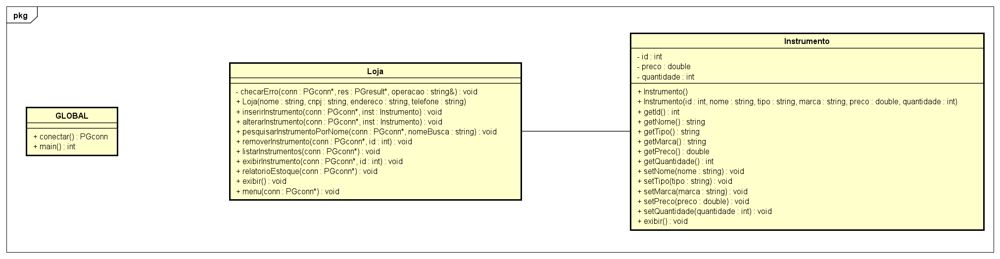

<a id="readme-top"></a>
# :guitar::musical_note: Rock ’n’ Code Instrumentos

- ### [:dart: Objetivo](#dart-objetivo-1)
- ### [:notes: Diagrama de Classes](#notes-diagrama-de-classes-1)
- ### [:control_knobs: Dependências](#control_knobs-dependências-1)
- ### [:musical_score: Documentação](#musical_score-documentação-1)
- ### [:loud_sound: Como rodar](#loud_sound-como-rodar-1)
- ### [:arrow_down: Baixar o projeto](https://github.com/ArtLuAs/Rock-n-Code-Instrumentos/archive/refs/heads/main.zip)

## Disciplina de Banco de Dados I

Esse foi um projeto desenvolvido por discentes do curso de *Engenharia da Computação da Universidade Federal da Paraíba*, curso este que pertence ao *[Centro de Informática](http://ci.ufpb.br/)*, localizado na *[Rua dos Escoteiros S/N - Mangabeira - João Pessoa - Paraíba - Brasil](https://g.co/kgs/xobLzCE)*. O sistema implementado consiste em uma aplicação integrada a banco de dados, estruturada a partir de modelagem UML, que realiza operações CRUD, além de gerar relatórios gerenciais com resumo das informações cadastradas, conforme as especificações propostas pelo docente.

### :musical_note: Autores:

-  :guitar:  *[Eduardo Asfuri Carvalho](https://github.com/Asfuri)*
-  :guitar:  *[Lucas Henrique Vieira da Silva](https://github.com/hvslucas)*

###  :musical_note: Docente:

-  :guitar: *[Marcelo Iury de Sousa Oliveira](https://github.com/marceloiury)*

<a href="#readme-top">
  
</a>


## :dart: Objetivo:

O projeto **Rock ’n’ Code Instrumentos** tem como objetivo desenvolver um sistema na linguagem C++, operado via terminal, que proporcione ao usuário a gestão eficiente de dados de uma loja de instrumentos musicais. Esta etapa refere-se à **Parte 1** do projeto da disciplina de Banco de Dados I. O gerenciamento das informações é realizado de forma autônoma pelo usuário e conta com a integração robusta de um banco de dados relacional (PostgreSQL), utilizando comandos na linguagem SQL para a persistência e manipulação dos registros. 

O sistema segue aos requisitos de desenvolvimento estabelecidos pelas especificações da Parte 1, sendo eles:

1. Ser um sistema de cadastro (CRUD) focado em estoque, clientes ou vendas, contendo um menu com opções para: Inserir, Alterar, Pesquisar por nome, Remover, Listar todos e Exibir um registro específico.
2. Utilizar uma classe dedicada especificamente para gerenciar as operações CRUD no banco de dados.
3. Garantir que o objeto principal do sistema possua pelo menos 4 atributos.
4. Fazer uso abundante de métodos na estrutura do código.
5. Gerar um relatório com um resumo das informações (como relatório de vendas, estoque ou clientes).
6. Exibir no relatório dados agregados, como a quantidade de elementos cadastrados e o valor total.

<a href="https://github.com/Maximusthr">
  
</a>


## :notes: Diagrama de Classes



## :control_knobs: Dependências

Este projeto foi desenvolvido utilizando funcionalidades essenciais da biblioteca padrão do C++ e uma biblioteca externa fundamental para a integração com o banco de dados relacional[^1][^2]. Abaixo, dissertamos sobre a utilidade de cada uma das bibliotecas implementadas e exemplos de sua utilidade dentro do sistema:

[^1]: ***[Biblioteca Padrão do C++](https://en.cppreference.com/w/cpp/header)***
[^2]: ***[PostgreSQL C API (libpq)](https://www.postgresql.org/docs/current/libpq.html)***

### Biblioteca Padrão

- **`<iostream>`**: Usada para operações básicas de entrada e saída, como leitura de dados do teclado (`std::cin`) e escrita de dados na tela (`std::cout`).
  - **Implementação:** Na interação direta com o usuário via terminal, exibindo o menu de gerenciamento e coletando os dados dos instrumentos musicais para as operações do sistema.

- **`<string>`**: Fornece suporte à manipulação de cadeias de caracteres, permitindo o uso da classe `std::string` e métodos utilitários, tornando o trabalho com textos mais seguro e conveniente.
  - **Implementação:** No armazenamento dos atributos textuais da classe `Instrumento` (como nome, tipo e marca) e, principalmente, na concatenação dinâmica das *queries* SQL (`INSERT`, `UPDATE`, `SELECT`) que são enviadas ao banco de dados.

- **`<cstdlib>`** *(implícita na compilação)*: Biblioteca herdada do C que fornece funções gerais, incluindo conversões de texto para números, como `atoi()` e `atof()`.
  - **Implementação:** Utilizada na extração dos dados retornados pelo banco de dados. Como o PostgreSQL retorna os valores em formato de texto (`PQgetvalue`), essas funções convertem os dados de volta para os tipos numéricos corretos (`int` para IDs e quantidade, `double` para preço) na hora de exibir as informações.

### Bibliotecas Externas / Banco de Dados

- **`<libpq-fe.h>`** *(Interface C do PostgreSQL)*: É a biblioteca C oficial do PostgreSQL. Ela permite que programas clientes passem consultas para o servidor de banco de dados e recebam os resultados de volta.
  - **Implementação:** É o núcleo da persistência de dados do projeto. Utilizada ativamente na classe `Loja` para estabelecer a conexão com o banco `loja_musical` (usando `PQconnectdb`), enviar os comandos CRUD (usando `PQexec`), e gerenciar o estado da conexão e da memória alocada para os resultados (com ponteiros genéricos `PGconn` e `PGresult`).
 
<a href="https://github.com/Yvesena">
  
</a>

## :musical_score: Documentação

### :open_file_folder: Estrutura do Projeto

```text
.
├── headers/
│   ├── instrumento.hpp      # Declaração da classe Instrumento
│   └── lojaGerencia.hpp     # Declaração da classe Loja e operações de DB
├── src/
│   ├── instrumento.cpp      # Implementação da classe Instrumento (Getters/Setters)
│   ├── lojaGerencia.cpp     # Implementação do CRUD, relatórios e menu interativo
│   └── main.cpp             # Ponto de entrada, inicialização e conexão com o banco
├── sql/
│   └── loja_musical.sql     # Script de criação do banco de dados, tabelas e permissões
├── docs/                    # Arquivos que documentam ou representam o projeto
└── README.md                # Este arquivo, documenta o projeto
```

### :page_facing_up: Classes e Atributos

A parte 1 do sistema do Rock ’n’ Code Instrumentos é estruturado em torno de duas classes principais em C++, que separam a representação dos dados da lógica de negócios e persistência.

**1. Classe `Instrumento`**:
Esta classe atua como o modelo de dados (Data Transfer Object) do sistema. Ela armazena as informações de um instrumento musical em memória antes de ser enviado ou após ser recuperado do banco de dados.

**Atributos:**
* **`id`** (`int`): Identificador único do instrumento (gerenciado pelo banco de dados).
* **`nome`** (`string`): Nome ou modelo do instrumento (ex: "Stratocaster").
* **`tipo`** (`string`): Categoria do instrumento. Restrito a guitarra, violao ou baixo.
* **`marca`** (`string`): Fabricante do instrumento (ex: "Fender", "Gibson").
* **`preco`** (`double`): Valor monetário de venda do instrumento.
* **`quantidade`** (`int`): Total de unidades disponíveis no estoque físico.

**2. Classe `Loja`**:
Esta classe gerencia as informações gerais do estabelecimento e centraliza toda a lógica de interação com o usuário (Menu) e com o banco de dados (CRUD). 

**Atributos Principais:**
* **`nome`** (`string`): Razão social ou nome fantasia ("Loja Musical").
* **`cnpj`** (`string`): Registro corporativo da loja.
* **`endereco`** (`string`): Localização física da loja.
* **`telefone`** (`string`): Informação de contato.

**Relacionamento com o Banco de Dados:**
Os métodos da classe `Loja` (`inserirInstrumento`, `alterarInstrumento`, `listarInstrumentos`, etc.) recebem um ponteiro de conexão PostgreSQL (`PGconn*`) e executam queries SQL diretas usando a biblioteca `libpq`. Toda vez que o usuário solicita uma ação no menu, a classe converte a requisição em uma instrução SQL, garantindo que o C++ reflita o estado em tempo real do banco de dados.

<a href="https://github.com/pedroarawj">
  
</a>

## :loud_sound: Como rodar

***Requisitos***
- Um compilador C++, recomendamos o `g++` ou o `clang++`
- Um terminal de linha de comando
- PostgreSQL instalado (incluindo a biblioteca `libpq`)

[**Atenção:** Lembre de baixar o projeto e extraí-lo devidamente do `.zip`.](#guitarmusical_note-rock-n-code-instrumentos)

### No Windows (Recomendado via MSYS2 / MinGW)

Esta é a forma mais direta caso você utilize o ambiente `MSYS2 (UCRT64)`. 

Primeiro, certifique-se de ter disponível o seu compilador de preferência.
Após isso, certifique-se de instalar as dependências `PostgreSQL` no terminal do `MSYS2`:

```sh
pacman -S mingw-w64-ucrt-x86_64-postgresql
```

Utilizando `g++` para compilar:

```sh
g++ .\src\*.cpp .\main.cpp -o loja.exe -lpq
```

Utilizando `clang++` para compilar:

```sh
clang++ .\src\*.cpp .\main.cpp -o loja.exe -lpq
```

Para rodar:

```sh
.\loja.exe
```

### No Windows (Referenciando o local em disco do include)

Caso você tenha o `PostgreSQL` instalado no Windows (sem `MSYS2`) e queira apontar os caminhos da biblioteca manualmente. Lembre-se que a arquitetura do seu compilador (ex: 64 bits) deve ser compatível com a arquitetura da instalação do `Postgres`.

Utilizando `g++` para compilar (substitua `<versao>` pela versão do seu banco, ex: 15):

```sh
g++ src\*.cpp main.cpp -I"C:\Program Files\PostgreSQL\<versao>\include" -L"C:\Program Files\PostgreSQL\<versao>\lib" -lpq -o loja.exe
```

Nota: Ao compilar dessa forma, se a `libpq.dll` não estiver mapeada nas Variáveis de Ambiente (PATH) do seu sistema, o executável poderá não abrir. Caso isso ocorra, basta copiar o arquivo libpq.dll da pasta lib do `PostgreSQL` para o mesmo diretório onde o loja.exe foi gerado.

### Linux (Bash)

Antes de compilar no Linux, certifique-se de ter os pacotes de desenvolvimento do `PostgreSQL` instalados. Em distribuições baseadas em Debian/Ubuntu, utilize:

```sh
sudo apt-get install libpq-dev
```

Utilizando `g++` para compilar:

```sh
g++ src/*.cpp main.cpp -lpq -o loja.out
```

Utilizando `clang++` para compilar:

```sh
clang++ src/*.cpp main.cpp -lpq -o loja.out
```

Para rodar:

```sh
./loja.out
```

### Atenção
Para warnings referentes a codificação, recomendamos o uso da seguinte flag na compilação (válido para clang++)
```sh
-Wno-invalid-source-encoding
```

**OBS.:** Utilizamos de barra normal ('/') considerando um ambiente como Git Bash, WSL e PowerShell, considere utilizar de barra invertida ('\\') em caso de não compilar

<a href="https://github.com/MarcoFilho1">
  
</a>

